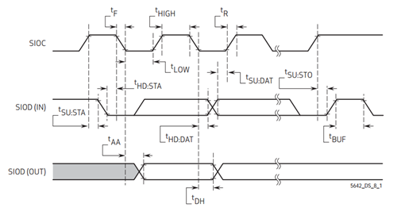
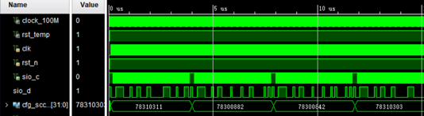
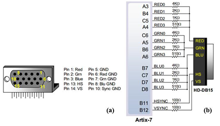
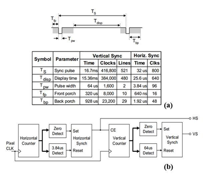
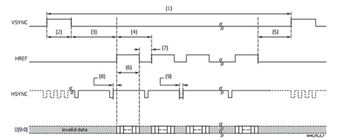
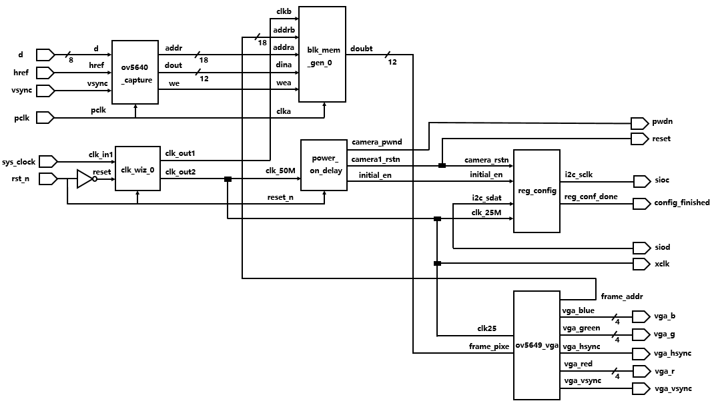
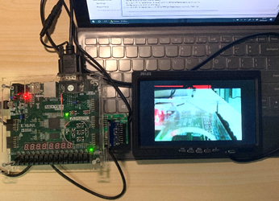

# Xilinx-NEXYS4_DDR-Drives-OV5640
## A Final Project in EE332 Digital System Design @ SUSTech
> 
>
> This work is licensed under a <a rel="license" href="http://creativecommons.org/licenses/by-nc-nd/4.0/">Creative Commons Attribution-NonCommercial-NoDerivatives 4.0 International License</a>.
>
> **Mail:** gyj980717@foxmail.com 
>
> **QQ: 846723371**

 The aiming of this project is to realize the image capture using OV5640 camera and FPGA which transmits the image signal using VGA (Video Graphic Array) standard on an LCD screen.

### Project Principle 

 

**1)**  Powerup of OV5640

​                               

**Fig.2.** Power up timing with external DVDD source

 

Based on the system power configuration, the power up sequence  would differ. If 1.8V is used for I/O power, using the internal DVDD is preferred. If 2.8V is used for I/O power, due to a high voltage drop at the internal DVDD regulator, there is a potential heat issue. Hence, for a 2.8V power system, OmniVision recommends using an external DVDD source. The powerup of OV5640 needs a specific output sequential, which is driven by FPGA. Fig.2 shows this operation including DOVDD, AVDD, DVDD, PWDN and RESETB. In our design, DOVDD, ACDD and DVDD is always high. PWDN is pull-down and RESETB is pull-up with certain time delay. The simulation results as shown in Fig.3 is consistent with the figure in Fig.2.

 

**Fig.3.** Simulation waveform of power up 

**2**) Configuration of OV5640**

 

 

**Fig.4.** SCCB interface timing 

 

OV5640 has 304 registers which need to be configured to make the system work desirably. To write data into registers, SCCB (Serial Camera Control Bus) protocol is applied in this device including clock port (SIOC) and bus data port (SIOD) as shown in Fig.4. At falling edge of SIOC, the data at SIOD is read. To configure one register, data including device address (0x78 for OV5640), register address (EX: 0x4300) and data written into register (EX: 0xA1) are transported in 32 clock period. The simulation results as shown in Fig.5 is consistent with the figure in Fig.4.

 

 

**Fig.5.** Simulation waveform of configuration

 

 **3) VGA Display**

**Fig.6.** (a) Schematic of VGA interface. (b) Pins for VGA output on FPGA board

 A basic VGA interface including HS (Horizontal Sync), VS (Vertical Sync), RGB (Red, Green and Blue) signal pins as shown in Fig.6(a). The VS signal defines the “refresh” frequency of the display, or the frequency at which all information on the display is redrawn. In order to drive the screen, FPGA board provides 14 pins including 4 pins for each color and 2 sync signal pins as shown in Fig.6 (b). So, using this FPGA board can realize 212=4096 colors for each pixel. In this project, the output will be 640*480 resolution image and the standards for HS and VS signals of this resolution are shown in Fig.7(a). Aiming to control the HS and VS signal synchronously, the controlling module should be designed as the block diagram shown in Fig7(b).

 

**Fig.7.** (a) Horizontal and vertical sync signal standard for 640*480 VGA output.  (b) VGA display controller block diagram.

 

 

4) DVP

 

**Fig.8.** Time sequence of DVP.

 

The Digital Video Port (DVP) provides 10-bit parallel data output in all formats supported and extended features including compression mode, HSYNC mode, CCIR656 mode, and test pattern output. The DVP is also used to receive the video data from an external camera, which will be sent out through the OV5640 MIPI interface transmit to FPGA board. The DVP time sequence is shown in Fig.8. When OV5640 camera outputs an image, it outputs the data frame by frame. The data in the frame is usually output from left to right, from top to bottom, one pixel by one pixel. Pixel data is transmitted sequentially. HREF will output a level jump signal when one line of data is transmitted. VSYNC will output a level jump signal when one frame of image is transmitted.

1) The block of ***clk_wiz_0***  is used as clock generator. It generates one clock for the block ***blk_mem_gen_0\*** and the other for the module of OV5640 camera and VGA. 

2)  The block of ***power_on_delay***  is used to powerup the module of OV5640 camera.

3)  The block of ***reg_config***  is used to configure 304 registers in the module of OV5640 camera.

4)  The block of ***OV5640_capture***  is used to real-time capture the video image.

5)  The block of ***blk_mem_gen_0***  is used to buffer the rate of data captured by camera so that it is consistent with the rate outputed by VGA.

6) The block of ***ov5640_vga***  is used to complete display the video image on screen.

 

​      Terefore, according to the block diagram and each block’s function, the design of key block modules is the capture, powerup and configuration of OV5640 camera.

The photo of this project system is shown in Fig.10. The real-time captured image is displayed on screen.   

**Fig.10.** Test Result of the project
